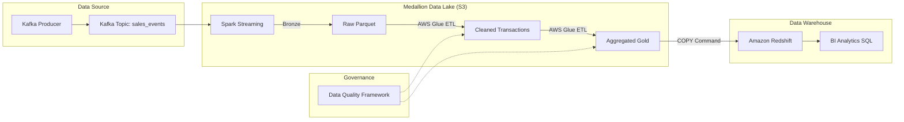

# Real-Time & Batch Sales Analytics Data Pipeline

[](https://github.com/topics/data-engineering)
[](https://kafka.apache.org/)
[](https://spark.apache.org/)
[](https://aws.amazon.com/)

## 📌 Project Overview
A production-grade, end-to-end data engineering pipeline designed to ingest, process, and analyze e-commerce sales data in real-time and batch. The project follows the **Medallion Architecture** (Bronze, Silver, Gold) using a modern data stack including Kafka, Spark Structured Streaming, AWS Glue, S3, and Amazon Redshift.

### Key Features
- **Real-Time Ingestion**: Python-based Kafka Producer simulating high-velocity sales events.
- **Stream Processing**: Spark Structured Streaming with schema enforcement and malformed record handling.
- **Medallion Architecture**: Automated data progression from raw (Bronze) to cleaned (Silver) to aggregated (Gold).
- **Data Quality Framework**: Integrated checks for row counts, null values, and duplicates.
- **Warehouse Optimization**: Star schema design in Amazon Redshift with efficient DISTKEYS and SORTKEYS.
- **Business Intelligence**: Analytical SQL suite for executive-level reporting (Daily Trends, Revenue Growth, etc.).

---

## 🏗️ Architecture



---

## 📂 Project Structure
```text
real-time-sales-data-pipeline/
├── kafka/              # Real-time event simulation
├── spark/              # Streaming logic & common transformations
├── glue/               # Batch ETL orchestration
├── sql/                # Redshift DDL & Analytics
├── data/               # Sample dataset (CSV)
├── data_quality/       # DQ Framework (Null checks, Row counts)
├── config/             # Centralized pipeline configuration
└── README.md           # Professional documentation
```

---

## 🚀 Setup & Execution

### 1. Prerequisites
- Python 3.9+
- Apache Kafka Cluster (Local or AWS MSK)
- Apache Spark 3.3+
- AWS Account (S3, Glue, Redshift)

### 2. Installation
```bash
pip install -r requirements.txt
```

### 3. Quick Start (Local Simulation) ⚡
Don't have Spark or Kafka installed? No problem! Run the **Local Simulation Runner** to see the entire pipeline logic (Bronze -> Silver -> Gold) in action using Pandas.
```bash
python scripts/local_demo_runner.py
```
*This will create a `data/local_lake` directory with processed Parquet files.*

### 4. Full Pipeline Execution (Production Flow)
1. **Start Kafka Producer**:
   ```bash
   python kafka/producer.py
   ```
2. **Start Streaming Consumer**:
   ```bash
   spark-submit --packages org.apache.spark:spark-sql-kafka-0-10_2.12:3.4.0 spark/streaming_consumer.py
   ```
3. **Execute Batch ETL (Glue)**:
   Upload `glue/glue_etl_job.py` and `spark/transformations.py` to AWS Glue and run the job.

---

## ⚡ Data Quality & Optimizations

### Data Quality Framework
Located in `data_quality/quality_checks.py`, the framework ensures:
- **Row Count Validation**: Ensures < 5% data loss between ingestion and transformation.
- **Null Prevention**: Critical columns (order_id, revenue) are validated for 100% population.
- **Deduplication**: Idempotent processing using `row_number()` window functions (PySpark) and `drop_duplicates` (Pandas simulation).

### Redshift & Warehouse Optimization
- **Star Schema**: Optimized for analytical queries.
- **DISTSTYLE ALL**: Applied to small dimension tables to eliminate broadcast joins.
- **SORTKEY**: Applied on `order_ts` for time-series optimization.

---

## 📈 Analytical Insights
The following business questions are answered using the [SQL suite](sql/analytics_queries.sql):
- **MoM Revenue Growth**: Monthly performance tracking.
- **Category Leaders**: Top revenue-driving product categories.
- **Daily Trends**: Order volume tracking across different regions.

---

## 🔮 Future Improvements
- [ ] Implement CI/CD using GitHub Actions and Terraform for IaC.
- [ ] Add real-time dashboarding using Streamlit or Amazon Quicksight.
- [ ] Incorporate Slack/PagerDuty alerts for Data Quality failures.
- [ ] Implement Slowly Changing Dimensions (SCD Type 2) for Customer history.

---
**Developed by:** Data Engineering Team
**License:** MIT
