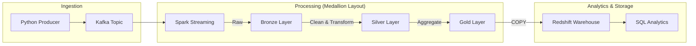

# Real-Time & Batch Sales Analytics Pipeline

Building a data pipeline isn't just about moving data from A to B; it's about ensuring reliability, scalability, and getting actual business insights at the end of the day. This project is a complete end-to-end data engineering pipeline that handles both real-time streams and batch processing for e-commerce sales data.

## Why I Built This
The goal was to simulate a production-grade environment. I wanted to see how data flows from a high-velocity Kafka stream through a multi-layered "Medallion" architecture (Bronze, Silver, Gold layers) and finally into a warehouse like Redshift for analytics.

## The Architecture
The pipeline follows a modern data stack approach. Here’s how the data travels:



### What's happening under the hood?
- **Real-Time Data**: I built a Python producer that simulates real sales events. It’s not just random data; it mimics high-velocity traffic you’d see in a real shop.
- **Spark Structured Streaming**: This is the heart of the ingestion. It handles the Kafka stream, enforces schemas, and makes sure malformed records don't break everything.
- **Medallion Architecture**: I used the Bronze/Silver/Gold approach to keep data organized. Raw data lands in Bronze, cleaned/refined data moves to Silver, and business-ready aggregations live in Gold.
- **Data Quality**: I didn't want "garbage in, garbage out." The pipeline includes checks for row counts (to monitor data loss) and null prevention for critical fields like IDs and revenue.
- **Storage & Warehouse**: Everything is stored in S3 at each layer. Finally, the Gold data is moved to Amazon Redshift using a Star Schema design (optimized with DISTKEYS and SORTKEYS) for super-fast queries.

## Project Structure
- `kafka/`: The code for generating and producing events.
- `spark/`: Streaming logic and the core transformation functions.
- `glue/`: Batch ETL jobs for moving and cleaning data between layers.
- `sql/`: All the DDL for Redshift and the analytical queries I used to get insights.
- `data_quality/`: The utility scripts I wrote for DQ checks.

## Getting Started

### Prerequisites
You'll need Python 3.9+, and depending on how you want to run it, either a local Kafka/Spark setup or an AWS account (S3, Glue, Redshift).

### 1. The Local Shortcut ⚡
If you don't want to set up the full infra (Kafka/Spark) right away, I've included a local runner. It uses Pandas to simulate the pipeline logic so you can see the data transformations in action without the overhead.
```bash
python scripts/local_demo_runner.py
```

### 2. The Real Deal (Production Setup)
To run the full streaming pipeline:
1. **Fire up the Producer**: `python kafka/producer.py`
2. **Start the Spark Stream**: 
   ```bash
   spark-submit --packages org.apache.spark:spark-sql-kafka-0-10_2.12:3.4.0 spark/streaming_consumer.py
   ```
3. **Run ETL Jobs**: Deploy the Glue scripts to move data through the Gold layer.

## My Role + What I Learned
This project was a solo effort where I acted as the end-to-end Data Engineer. I was responsible for:
- Designing the multi-layer S3 data lake architecture.
- Writing the PySpark streaming logic and Glue ETL jobs.
- Managing the Redshift schema and analytical SQL suite.

**Key Learnings:**
- **Streaming Reliability:** I learned how critical checkpointing and schema enforcement are when dealing with Kafka. Without them, even one bad JSON record can kill a production job.
- **Architectural Trade-offs:** Building the local simulation first taught me how to decouple logic from infrastructure, making it much easier to debug PySpark transformations before deploying to the cloud.
- **Data Quality as a First-Class Citizen:** I realized that pipelines aren't "set it and forget it." Monitoring row count drift and null percentages is what makes a pipeline production-ready.

## Sample Pipeline Output
I've included a local simulation runner that mimics the full cloud flow. Here is what the automated data progression looks like as it moves through the layers:

```text
Processing Batch: Ingesting from Kafka Simulation...
[Bronze Layer] Saved 100 raw events to Parquet.
[Silver Layer] Cleaned 100 records. Deduplication removed 0 duplicates.
[Gold Layer] Aggregated revenue by category. Total Gold Records: 8.

Sample Gold Record (Aggregated):
{
  "category": "Electronics",
  "total_revenue": 4520.50,
  "order_count": 42,
  "avg_order_value": 107.63,
  "window_start": "2024-05-20 10:00:00"
}
```

## Insights & Lessons
I used the final Redshift data to answer some real-world business questions, like tracking month-over-month growth and finding the top-selling categories. You can find these queries in `sql/analytics_queries.sql`.

One of the biggest lessons was handling data drifts and malformed JSON. The Spark schema enforcement was a lifesaver there.

## What's Next?
- Automating the infrastructure deployment using Terraform.
- Building a live dashboard (maybe Streamlit) on top of Redshift.
- Adding Slack alerts for when a Data Quality check fails.

---
*Feel free to reach out if you have questions or suggestions!*
